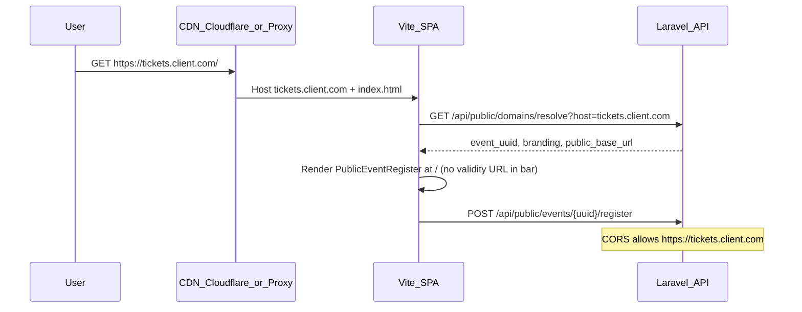

# Custom Domains for Evella — Implementation Plan

## Goals

- Organizers attach **verified subdomains** (e.g. `tickets.client.com`) that serve public registration/ticket pages without exposing `app.validity.et` in shared links.
- **Backend, payments, QR, analytics, and attendee records** remain on existing Evella infrastructure.
- **Admin/usher dashboards** stay on `app.validity.et` only.

## Non-goals (Phase 1)

- Apex domains (`client.com`)
- Path vanity URLs (`events.company.com/summit`) — defer to Phase 2
- JWT auth or dashboard on custom domains
- API white-label proxy (`/api` on customer host) — MVP keeps API on `api.validity.et` per your choice

## Current baseline (gaps)


| Area           | Today                                                                                                                                | Gap                                                   |
| -------------- | ------------------------------------------------------------------------------------------------------------------------------------ | ----------------------------------------------------- |
| Domain storage | None                                                                                                                                 | New `custom_domains` table + APIs                     |
| Public URLs    | Single `[FRONTEND_URL](validity_backend/config/app.php)` / `[getPublicSiteURL()](event-horizon-dashboards/src/config/env.ts)`        | ~15 backend call sites + frontend link builders       |
| Event identity | `[events.uuid](validity_backend/database/migrations/2025_06_21_000001_create_events_table.php)`                                      | Spec’s `target_slug` → use `target_event_uuid` in MVP |
| Host routing   | Vite SPA, no server middleware                                                                                                       | Edge/Worker + SPA `TenantProvider`                    |
| CORS           | Static list in `[config/cors.php](validity_backend/config/cors.php)`                                                                 | Dynamic allowlist for active domains                  |
| OG previews    | `[EventShareMetadataController](validity_backend/app/Http/Controllers/EventShareMetadataController.php)` redirects to `FRONTEND_URL` | Must redirect to custom domain when active            |


---

## Architecture




**Hostname resolution order**

1. Match `custom_domains.hostname` where `verification_status = active`
2. If `event_id` set → that event; else organizer default (Phase 2)
3. Fallback → `config('app.frontend_url')`

**SSL / routing (include both options; recommend Cloudflare for SaaS)**


| Option                                    | Pros                                                   | Cons                                   |
| ----------------------------------------- | ------------------------------------------------------ | -------------------------------------- |
| **A — Cloudflare for SaaS** (recommended) | Auto SSL, CNAME onboarding, DDoS, custom hostnames API | Cloudflare account + SaaS setup        |
| **B — nginx + Certbot**                   | Full control on existing VPS                           | Per-domain cert ops, slower onboarding |


Plan implementation against **Option A** with Option B documented as fallback for non-Cloudflare deploys.

**CNAME target (configurable):** `cname.evella.app` → SPA origin (Vercel/static bucket/EC2).

---

## Phase 1 — MVP (target: 6–8 weeks)

### 1. Database and models (Laravel)

**Migration:** `custom_domains`

```sql
-- Laravel types: bigint PKs, not UUID PKs
custom_domains (
  id,
  organizer_id FK organizers,
  event_id FK events NULL,
  hostname VARCHAR(255) UNIQUE,        -- lowercase, punycode-normalized
  target_event_uuid CHAR(36) NULL,   -- required when event_id set
  route_mode ENUM('root') DEFAULT 'root',  -- Phase 2: 'path'
  path_prefix VARCHAR(100) NULL,
  verification_token VARCHAR(64),
  verification_status ENUM('pending','verifying','active','failed','disabled'),
  ssl_status ENUM('pending','provisioning','active','failed'),
  ssl_provider VARCHAR(50) NULL,       -- cloudflare | letsencrypt
  branding JSON NULL,                  -- logo_url, primary_hsl, favicon_url, footer_text
  verified_at, activated_at,
  last_dns_check_at, last_error TEXT NULL,
  created_by FK users,
  timestamps, soft_deletes
)
```

**Indexes:** `hostname`, `(organizer_id, event_id)`, `verification_status`.

**Model:** `[app/Models/CustomDomain.php](validity_backend/app/Models/CustomDomain.php)` with relations to `Organizer`, `Event`; scopes `active()`, `forHost($host)`.

**Optional:** `domain_verification_logs` for admin audit (DNS snapshots, errors).

**Constraint:** One **active** domain per `event_id` (app-level + unique partial index if DB supports).

---

### 2. Core backend service

**New:** `[app/Services/PublicUrlService.php](validity_backend/app/Services/PublicUrlService.php)`

```php
// Resolution priority
public function baseUrlForEvent(Event $event): string
public function registrationUrl(Event $event, array $query = []): string
public function ticketPurchaseUrl(Event $event, array $query = []): string
public function badgeRetrieveUrl(Event $event): string
```

- Active custom domain for event → `https://{hostname}`
- Else → `rtrim(config('app.frontend_url'), '/')`

**Refactor all link emitters** to use `PublicUrlService` (replace duplicated `getFrontendUrl()`):


| File                                                                                                         | Usage                                |
| ------------------------------------------------------------------------------------------------------------ | ------------------------------------ |
| `[Invitation.php](validity_backend/app/Models/Invitation.php)`                                               | Invitation links                     |
| `[InvitationController.php](validity_backend/app/Http/Controllers/InvitationController.php)`                 | Bulk invite URLs                     |
| `[ShortLink.php](validity_backend/app/Models/ShortLink.php)`                                                 | Short links                          |
| `[EventAccessCodeController.php](validity_backend/app/Http/Controllers/EventAccessCodeController.php)`       | Onsite `/reg/{code}`                 |
| `[EventShareMetadataController.php](validity_backend/app/Http/Controllers/EventShareMetadataController.php)` | OG redirect destination              |
| `[AttendingShareController.php](validity_backend/app/Http/Controllers/AttendingShareController.php)`         | Share banners                        |
| `[PublicShareController.php](validity_backend/app/Http/Controllers/PublicShareController.php)`               | Public share                         |
| `[VendorReferral.php](validity_backend/app/Models/VendorReferral.php)`                                       | Referral links                       |
| Email views under `[resources/views/emails/](validity_backend/resources/views/emails/)`                      | Pass `$publicBaseUrl` from mailables |


**Keep on `app.validity.et`:** `[SubscriptionPaymentService.php](validity_backend/app/Services/SubscriptionPaymentService.php)` dashboard payment returns.

**Mail classes to update:** `[RegistrationConfirmationMail](validity_backend/app/MAIL/RegistrationConfirmationMail.php)`, `[TicketPurchasedMail](validity_backend/app/Mail/TicketPurchasedMail.php)`, `[EventInvitationMail](validity_backend/app/Mail/EventInvitationMail.php)` — inject resolved URLs in `with:`.

---

### 3. API endpoints

**Public (no auth, cached):**

- `GET /api/public/domains/resolve?host={hostname}`  
Returns: `{ event_uuid, event_id, event_type, organizer_id, branding, public_base_url, routes: { registration, tickets, badge_retrieve } }`  
Cache: 5 min (Redis/file), invalidate on domain activate/disable.

**Organizer (JWT + `organizer.permission`):**

- `GET /organizers/{organizer}/custom-domains`
- `POST /organizers/{organizer}/custom-domains` — body: `hostname`, `event_id`
- `GET .../custom-domains/{id}/dns-instructions` — CNAME `host` → `cname.evella.app`
- `POST .../custom-domains/{id}/verify` — trigger DNS check job
- `DELETE .../custom-domains/{id}` — disable
- `PATCH .../custom-domains/{id}/branding` — logo/colors (optional MVP)

**Admin:**

- `GET /admin/custom-domains` — list all, filter by status
- `POST /admin/custom-domains/{id}/disable|reverify|force-activate` (guarded)

Register routes in `[routes/api.php](validity_backend/routes/api.php)`.

---

### 4. DNS verification and SSL jobs

**New jobs:**

- `VerifyCustomDomainDnsJob` — resolve CNAME (and optional TXT ownership); set `verifying` → `active` or `failed` with `last_error`
- `ProvisionCustomDomainSslJob` — Cloudflare Custom Hostnames API **or** noop when SSL handled entirely at edge

**Scheduler:** retry verifying domains every 15 min for 48h, then mark failed.

**Validation rules:**

- Hostname must be FQDN subdomain (regex: at least one dot, not `validity.et`, not IP)
- Block reserved hosts (`app`, `api`, `www` on your zones)
- Normalize to lowercase; IDN → punycode

**Security:** Domain only attachable if `event.organizer_id` matches authenticated organizer.

---

### 5. CORS and config

**Update `[config/cors.php](validity_backend/config/cors.php)`:**

- Keep static origins from env
- Add `CustomDomainCorsService` that merges active `custom_domains.hostname` into allowed origins (cache 5 min)

**New env vars (both repos):**


| Variable                     | Purpose                        |
| ---------------------------- | ------------------------------ |
| `CUSTOM_DOMAIN_CNAME_TARGET` | `cname.evella.app`             |
| `CLOUDFLARE_API_TOKEN`       | Custom Hostnames (if Option A) |
| `CLOUDFLARE_ZONE_ID`         | Evella zone                    |
| `CUSTOM_DOMAINS_ENABLED`     | Feature flag                   |


---

### 6. Share / OG on custom domains

Crawlers hit the **shared URL’s host**. When share links use custom domain:

**Option 1 (recommended):** Cloudflare Worker on customer host proxies `/share/`* to Laravel `[routes/web.php](validity_backend/routes/web.php)` share routes, rewriting `destination` in `[EventShareMetadataController::previewResponse](validity_backend/app/Http/Controllers/EventShareMetadataController.php)` via `PublicUrlService`.

**Option 2:** Laravel serves OG at `https://api.validity.et/share/register/{uuid}` only; organizers must share that URL (leaks API host) — **not acceptable for white-label**.

**Change in `previewResponse`:** `$destination = PublicUrlService::registrationUrl($event, $query)`.

---

### 7. Analytics and registration attribution

- Add optional `custom_domain_id` or `registration_host` on registration/log writes in `[EventController::publicRegister](validity_backend/app/Http/Controllers/EventController.php)` / attendee create paths
- Accept header `X-Public-Host` or body field from SPA (validated against active domain for event)
- Extend share analytics if `[ShareAnalyticsController](validity_backend/app/Http/Controllers/ShareAnalyticsController.php)` exists — segment by host

---

### 8. Frontend — tenant resolution (Vite SPA)

**New modules in `[event-horizon-dashboards/src/](event-horizon-dashboards/src/)`:**


| File                          | Role                                                                                                                             |
| ----------------------------- | -------------------------------------------------------------------------------------------------------------------------------- |
| `lib/tenant/resolveTenant.ts` | `GET /public/domains/resolve` on boot                                                                                            |
| `contexts/TenantContext.tsx`  | `{ host, eventUuid, eventId, branding, publicBaseUrl, isCustomDomain }`                                                          |
| `lib/publicUrl.ts`            | `resolvePublicBaseUrl()`, wraps/replaces `[getPublicSiteURL()](event-horizon-dashboards/src/config/env.ts)` for share/copy flows |
| `hooks/useTenantBranding.ts`  | Inject CSS variables from `branding` into `:root`                                                                                |


**Bootstrap in `[main.tsx](event-horizon-dashboards/src/main.tsx)` or `[AppRoutes.tsx](event-horizon-dashboards/src/routes/AppRoutes.tsx)`:**

```
if (hostname !== ADMIN_HOST && hostname !== localhost) {
  await resolveTenant()
}
```

**Admin host allowlist:** `app.validity.et`, `localhost`, `127.0.0.1` (env: `VITE_ADMIN_HOSTS`).

**New route (custom domain root):**

- `GET /` on custom host → `[TenantPublicHome](event-horizon-dashboards/src/pages/TenantPublicHome.tsx)` (thin wrapper)
  - Free event → embed/reuse `[PublicEventRegister](event-horizon-dashboards/src/pages/PublicEventRegister.tsx)` logic with `eventUuid` from context (not URL)
  - Ticketed → `[TicketPurchasePage](event-horizon-dashboards/src/pages/tickets/TicketPurchasePage.tsx)`

**Keep existing paths** (`/event/register/:uuid`) working on custom domains for backward compatibility, but copy-link UI should prefer `https://tickets.client.com/`.

**Update link builders:**

- `[publicRegistrationLinks.ts](event-horizon-dashboards/src/lib/publicRegistrationLinks.ts)` — use `tenant.publicBaseUrl` when present
- `[EventDetailsTabs.tsx](event-horizon-dashboards/src/features/events/components/EventDetailsTabs.tsx)` — copy pre-reg / onsite links via `publicUrl.ts`
- `[InvitationGenerator.tsx](event-horizon-dashboards/src/components/event-invitations/InvitationGenerator.tsx)`, survey panels

**Payments (MVP, separate API host):**

- Pass `return_url: ${window.location.origin}/registration/success` (or ticket success path) in `[lib/api/payments.ts](event-horizon-dashboards/src/lib/api/payments.ts)` / public ticket hooks
- Ensure success pages don’t `navigate` to `app.validity.et`

**Branding:**

- Override `--primary` and logo from `tenant.branding` on public pages only
- Favicon: dynamic `<link rel="icon">` in tenant bootstrap

---

### 9. Organizer dashboard UI

**New page:** `[src/pages/CustomDomains.tsx](event-horizon-dashboards/src/pages/CustomDomains.tsx)`

Wizard (matches your spec):

1. Enter hostname + select event
2. Show DNS: `CNAME tickets → cname.evella.app`
3. Verify button + status chips: Pending / Verifying / SSL / Active / Failed
4. Copy public URL + test link

**Navigation:**

- Add to `[AppSidebar.tsx](event-horizon-dashboards/src/components/AppSidebar.tsx)` under Settings or Events (organizer roles)
- Route in `[AppRoutes.tsx](event-horizon-dashboards/src/routes/AppRoutes.tsx)`: `/dashboard/custom-domains`
- Lazy import in `[lazyPages.ts](event-horizon-dashboards/src/routes/lazyPages.ts)`

**Event details shortcut:** In `[EventDetailsTabs.tsx](event-horizon-dashboards/src/features/events/components/EventDetailsTabs.tsx)`, show active domain badge + “Manage domain” link.

**Permissions:** New permission key `domains.manage` in organizer role permissions seed/migration; gate API + UI.

---

### 10. Admin panel UI

**New page:** `/dashboard/admin/custom-domains`

- Table: hostname, organizer, event, status, SSL, last error, created
- Actions: disable, reverify, view DNS log
- Tie to admin routes pattern in `[AppRoutes.tsx](event-horizon-dashboards/src/routes/AppRoutes.tsx)` (~line 848+)

---

### 11. Infrastructure and deployment

**SPA hosting:**

- Same build artifact for all hosts
- Platform must accept **unlimited custom hostnames** (Cloudflare + origin, or Vercel Pro custom domains per project limits)

**Checklist:**

1. Create `cname.evella.app` DNS record → SPA origin
2. Enable Cloudflare for SaaS (or document Certbot flow)
3. Add custom hostname via API when domain → `active`
4. Force HTTPS redirect at edge
5. SPA fallback: all paths → `index.html`

**Feature flag:** `CUSTOM_DOMAINS_ENABLED=false` in staging until DNS pipeline verified.

**Local dev:** Map `tickets.test.local` in `/etc/hosts` + seed `custom_domains` row pointing to test event UUID.

---

### 12. Security checklist


| Control          | Implementation                                                                                         |
| ---------------- | ------------------------------------------------------------------------------------------------------ |
| Domain hijacking | CNAME must point to Evella target; optional TXT `_evella-verify.{host}`                                |
| HTTPS only       | Edge redirect; HSTS on custom hosts                                                                    |
| Cookie isolation | No admin JWT on custom domains; public flows stateless or sessionStorage scoped to host                |
| CORS             | Dynamic allowlist from active domains only                                                             |
| Rate limit       | Existing throttles on `[publicRegisterByUuid](validity_backend/routes/api.php)`; add per-host throttle |
| Abuse            | Admin disable + audit log                                                                              |


---

### 13. Testing plan

**Backend (PHPUnit):**

- DNS verification mock (CNAME present/absent)
- `PublicUrlService` resolution priority
- Organizer cannot attach domain to another organizer’s event
- CORS includes active domain

**Frontend (manual + optional Vitest):**

- Custom host loads registration without `/event/register/uuid` in address bar
- Copy link uses custom base URL
- Payment success stays on same host
- OG redirect destination uses custom domain (curl Facebook debugger)

**E2E staging:**

- Real subdomain on test zone → full register → email link → badge retrieve

---

## Phase 2 (post-MVP)

- `route_mode = path` + `events.public_slug` for `events.company.com/summit`
- Organizer-level domain (event picker landing)
- Full branding UI (typography, email templates per domain)
- Wildcard certs if needed
- Optional `/api` reverse proxy on custom domain for full white-label

## Phase 3

- Apex domain support (ALIAS/ANAME)
- Multi-domain per event (redirect rules)

---

## Risk register


| Risk                               | Mitigation                                       |
| ---------------------------------- | ------------------------------------------------ |
| `FRONTEND_URL` missed in refactor  | Grep CI check; central `PublicUrlService` only   |
| OG broken on custom domain         | Worker proxy to Laravel share routes             |
| Cloudflare SaaS cost/limits        | Document hostname quota; admin approval workflow |
| Event UUID in URL leaks internally | Root `/` tenant route for marketing URLs         |
| CORS cache stale after disable     | Invalidate cache on domain status change         |


---

## Success criteria

- Organizer verifies `tickets.client.com` and receives **Active** status
- Attendee opens `https://tickets.client.com/` and completes registration
- Confirmation email link uses `https://tickets.client.com/...`, not `app.validity.et`
- Payment success redirect stays on custom host
- Admin can disable domain; CORS and resolve API return 404 within cache TTL
- Analytics can report registrations by `registration_host`

