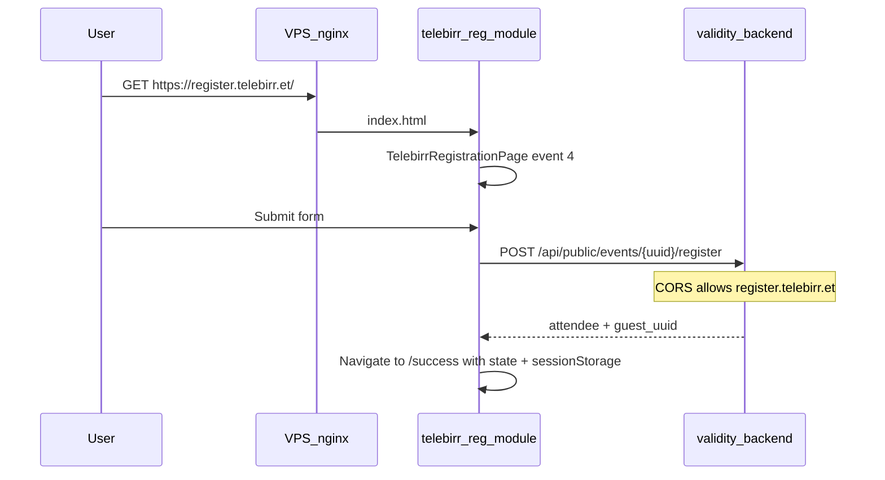

# Telebirr Custom Domain Integration Plan

## Goal

1. **Isolate Telebirr pages** into a dedicated, fully functional module at `src/pages/telebirr-reg/`
2. **Serve on a custom hostname** (placeholder: `register.telebirr.et`) while keeping admin on `app.validity.et` and API on `api.validity.et`

## Architecture




---

## Phase 0 — Telebirr-reg folder module (NEW)

### 0.1 Target folder structure

Create [src/pages/telebirr-reg/](event-horizon-dashboards/src/pages/telebirr-reg/):

```
src/pages/telebirr-reg/
├── index.ts                          # barrel exports
├── constants.ts                      # TELEBIRR_COLORS, DEFAULT_EVENT_ID, asset paths
├── types.ts                          # EventData, FormData, RegistrationState
├── routes.ts                         # path helpers (getRegisterPath, getSuccessPath)
├── sessionStorage.ts                 # persist/read/clear success payload
├── TelebirrRegLayout.tsx             # shared sticky navbar (Ethio Telecom + Telebirr logos)
├── TelebirrRegistrationPage.tsx      # moved from TelebirrRegistration.tsx
└── TelebirrRegistrationSuccessPage.tsx  # moved from TelebirrRegistrationSuccess.tsx
```

**Approach:** Move and refactor — not two parallel copies. Old flat files at `src/pages/TelebirrRegistration*.tsx` become thin re-exports (backward compat) or are deleted after all imports are updated.

### 0.2 What each file owns


| File                                  | Responsibility                                                                                                                  |
| ------------------------------------- | ------------------------------------------------------------------------------------------------------------------------------- |
| `constants.ts`                        | Brand colors (`#8DC63F`, `#005BAA`), default event ID `4`, logo paths (`/telebirr5th year logo.png`, `/ethio_telecom_logo.png`) |
| `types.ts`                            | `EventData`, `FormData`, `RegistrationSuccessState` interfaces currently inline in pages                                        |
| `routes.ts`                           | `telebirrRegisterPath(eventId)`, `telebirrSuccessPath(eventId)` — single source for navigate/redirect URLs                      |
| `sessionStorage.ts`                   | `saveRegistrationSuccess()`, `loadRegistrationSuccess()`, `clearRegistrationSuccess()` with 30-min TTL                          |
| `TelebirrRegLayout.tsx`               | Shared navbar used by both pages (extract duplicated header from register + success)                                            |
| `TelebirrRegistrationPage.tsx`        | Full registration form — same behavior as today                                                                                 |
| `TelebirrRegistrationSuccessPage.tsx` | Confirmation, QR, badge download, share banner — same behavior as today                                                         |


### 0.3 External dependencies (keep as shared libs)

These stay outside the folder — already app-wide and tested:

- `[@/lib/api](event-horizon-dashboards/src/lib/api.ts)` — event fetch + registration POST
- `[@/lib/fileValidation](event-horizon-dashboards/src/lib/fileValidation.ts)` — profile picture validation
- `[@/lib/registrationShareMeta](event-horizon-dashboards/src/lib/registrationShareMeta.ts)` — OG tags
- `[@/lib/publicBadgeDownload](event-horizon-dashboards/src/lib/publicBadgeDownload.ts)` — PDF download
- `[@/components/share/GuestShareBannerPanel](event-horizon-dashboards/src/components/share/GuestShareBannerPanel.tsx)` — share banner
- `[@/components/ui/*](event-horizon-dashboards/src/components/ui/)` — Button, Input, Select, Alert, etc.

No need to duplicate UI primitives — the module is **feature-isolated**, not a separate app.

### 0.4 Functional requirements (must pass after move)

Copy behavior exactly from current pages:

1. **Event load** — `GET /public/events/id/:eventId`; auto-select guest type from `?guest_type_id` / `?type` query params
2. **Registration submit** — `POST /public/events/:uuid/register` multipart (name, email, phone, country, city, company, job_title, guest_type_id, registration_type, profile_picture)
3. **Validation** — required: full name, phone, country, city; email format if provided; profile picture PNG/JPEG max 4MB
4. **Success navigation** — navigate to success path with `registrationData` + `eventData` in router state **and** sessionStorage
5. **Success page refresh** — fall back to sessionStorage when `location.state` is empty
6. **QR code** — full `guest_uuid` with Telebirr logo overlay
7. **Badge download** — `downloadPublicAttendeeBadgeWithToast` via public API
8. **Share banner** — `GuestShareBannerPanel` toggle
9. **Share meta** — `useRegistrationShareMeta` on registration page
10. **Theme** — force light theme on registration page (`useTheme`)
11. **Onsite mode** — `?reg_type=onsite` or `?type=onsite` changes navbar label + payload

### 0.5 Route wiring

Update [lazyPages.ts](event-horizon-dashboards/src/routes/lazyPages.ts):

```typescript
export const TelebirrRegistrationPage = lazy(
  () => import('@/pages/telebirr-reg/TelebirrRegistrationPage'),
)
export const TelebirrRegistrationSuccessPage = lazy(
  () => import('@/pages/telebirr-reg/TelebirrRegistrationSuccessPage'),
)
```

Update [AppRoutes.tsx](event-horizon-dashboards/src/routes/AppRoutes.tsx):

**Legacy paths (keep working):**


| Path                                        | Component                               |
| ------------------------------------------- | --------------------------------------- |
| `/event/telebirr-register`                  | Redirect → `/event/telebirr-register/4` |
| `/event/telebirr-register/:eventId`         | `TelebirrRegistrationPage`              |
| `/event/telebirr-register/:eventId/success` | `TelebirrRegistrationSuccessPage`       |


**Short paths (for custom domain — Phase 3):**


| Path                                      | Component                         |
| ----------------------------------------- | --------------------------------- |
| `/` (on Telebirr public host only)        | `TelebirrRegistrationPage`        |
| `/success` (on Telebirr public host only) | `TelebirrRegistrationSuccessPage` |


Update redirects in [PublicEventRegister.tsx](event-horizon-dashboards/src/pages/PublicEventRegister.tsx) and [CustomEventRegistration.tsx](event-horizon-dashboards/src/pages/CustomEventRegistration.tsx) to use `routes.ts` helpers instead of hardcoded strings.

### 0.6 Cleanup

After all imports point to `telebirr-reg/`:

- Delete or replace [TelebirrRegistration.tsx](event-horizon-dashboards/src/pages/TelebirrRegistration.tsx) with:

```typescript
export { default } from './telebirr-reg/TelebirrRegistrationPage'
```

- Same for [TelebirrRegistrationSuccess.tsx](event-horizon-dashboards/src/pages/TelebirrRegistrationSuccess.tsx)

---

## Phase 1 — Infrastructure (VPS/nginx)

### 1.1 DNS (Telebirr IT)


| Type  | Name                             | Value                             |
| ----- | -------------------------------- | --------------------------------- |
| CNAME | `register` (or chosen subdomain) | `app.validity.et` or VPS hostname |


### 1.2 nginx vhost

Update [nginx.conf](event-horizon-dashboards/nginx.conf) or VPS site config:

- `server_name register.telebirr.et app.validity.et;`
- SPA fallback: `try_files $uri $uri/ /index.html`
- `/api/` proxy to `https://api.validity.et` (unchanged)

SPA handles `/` on the public host — no nginx rewrite needed once Phase 3 routing is in place.

### 1.3 SSL

```bash
certbot --nginx -d register.telebirr.et
```

---

## Phase 2 — Backend config (validity_backend)

### 2.1 CORS allowlist

Production `.env`:

```env
CORS_ALLOWED_ORIGINS=https://app.validity.et,https://register.telebirr.et,http://localhost:5173
```

Required because registration POSTs cross-origin to `api.validity.et`.

### 2.2 Optional event-specific URL

```env
TELEBIRR_PUBLIC_URL=https://register.telebirr.et
```

For event-4 share/invitation links only. Do **not** change global `FRONTEND_URL`.

---

## Phase 3 — Public host routing

### 3.1 Host config

Add [src/config/publicHosts.ts](event-horizon-dashboards/src/config/publicHosts.ts):

```typescript
export function isTelebirrPublicHost(): boolean
export function getTelebirrEventId(): string  // default '4'
export function isAdminHost(): boolean
```

Env: `VITE_TELEBIRR_PUBLIC_HOSTS=register.telebirr.et`

### 3.2 TelebirrPublicHostGate

In [AppRoutes.tsx](event-horizon-dashboards/src/routes/AppRoutes.tsx):

**On Telebirr public host:**


| Path                          | Behavior                          |
| ----------------------------- | --------------------------------- |
| `/`                           | `TelebirrRegistrationPage`        |
| `/success`                    | `TelebirrRegistrationSuccessPage` |
| `/dashboard`, `/signin`, etc. | Redirect to `/`                   |
| `/event/telebirr-register/`*  | Still works (legacy)              |


**On admin host:** unchanged.

### 3.3 Share meta

Already uses `window.location.origin` — works on custom domain automatically.

---

## Phase 4 — Environment & deploy

**Frontend:**

```env
VITE_API_URL=https://api.validity.et/api
VITE_TELEBIRR_PUBLIC_HOSTS=register.telebirr.et
VITE_TELEBIRR_EVENT_ID=4
VITE_ADMIN_HOSTS=app.validity.et,localhost,127.0.0.1
```

**Backend:**

```env
CORS_ALLOWED_ORIGINS=https://app.validity.et,https://register.telebirr.et,...
TELEBIRR_PUBLIC_URL=https://register.telebirr.et
```

Rebuild Docker image per [Dockerfile](event-horizon-dashboards/Dockerfile).

---

## Phase 5 — Testing checklist

**Module isolation (local dev):**

1. `/event/telebirr-register/4` loads from new folder — form renders, event data loads
2. Submit registration → success page with QR + guest name
3. Refresh success page → data persists via sessionStorage
4. Download e-badge PDF
5. Share banner opens and generates image
6. Profile picture upload validates and submits
7. `?type=onsite` changes navbar label

**Custom domain (staging via hosts file):**

1. `https://register.telebirr.et/` loads registration at root
2. `/success` works after registration
3. `/dashboard` redirects to `/`
4. CORS registration POST succeeds
5. OG share preview shows event title/image

---

## Phase 6 — Telebirr IT handoff

One-page doc: CNAME record, public URL, SSL contact, UAT checklist from Phase 5.

---

## Estimated effort


| Phase                             | Effort                 |
| --------------------------------- | ---------------------- |
| **Phase 0 — telebirr-reg folder** | **4–5 hours**          |
| Infrastructure (DNS, nginx, SSL)  | 2–4 hours (+ DNS wait) |
| Backend CORS                      | 30 min                 |
| Public host routing               | 2–3 hours              |
| Testing + IT handoff              | 2 hours                |
| **Total**                         | **~1.5–2 days**        |


---

## Files to create / change


| Action             | Path                                                         |
| ------------------ | ------------------------------------------------------------ |
| **Create**         | `src/pages/telebirr-reg/index.ts`                            |
| **Create**         | `src/pages/telebirr-reg/constants.ts`                        |
| **Create**         | `src/pages/telebirr-reg/types.ts`                            |
| **Create**         | `src/pages/telebirr-reg/routes.ts`                           |
| **Create**         | `src/pages/telebirr-reg/sessionStorage.ts`                   |
| **Create**         | `src/pages/telebirr-reg/TelebirrRegLayout.tsx`               |
| **Create**         | `src/pages/telebirr-reg/TelebirrRegistrationPage.tsx`        |
| **Create**         | `src/pages/telebirr-reg/TelebirrRegistrationSuccessPage.tsx` |
| **Update**         | `src/routes/lazyPages.ts`                                    |
| **Update**         | `src/routes/AppRoutes.tsx`                                   |
| **Update**         | `src/pages/PublicEventRegister.tsx`                          |
| **Update**         | `src/pages/CustomEventRegistration.tsx`                      |
| **Replace/delete** | `src/pages/TelebirrRegistration.tsx` (re-export stub)        |
| **Replace/delete** | `src/pages/TelebirrRegistrationSuccess.tsx` (re-export stub) |
| **Create**         | `src/config/publicHosts.ts`                                  |
| **Update**         | `src/vite-env.d.ts`                                          |
| **Update**         | `nginx.conf` or VPS site config                              |
| **Update**         | `validity_backend/.env` (production CORS)                    |


---

## Risk summary


| Risk                            | Mitigation                                          |
| ------------------------------- | --------------------------------------------------- |
| Broken imports after move       | Re-export stubs + update lazyPages in same PR       |
| Regression in registration flow | Phase 5 checklist before DNS go-live                |
| CORS blocks registration        | Add domain to `CORS_ALLOWED_ORIGINS` before go-live |
| Success page lost on refresh    | sessionStorage in new module                        |
| Admin exposed on public domain  | TelebirrPublicHostGate redirect                     |


